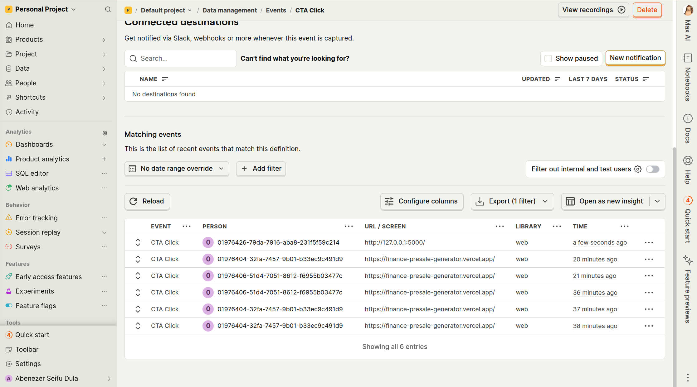

# 🚀 Finance Presale Page Generator Prototype

This is a prototype web application that generates **high-converting presale pages** for credit cards using the **OpenAI GPT-4 API**.
It allows users to input product details and automatically generates persuasive marketing content, renders it into a **responsive TailwindCSS template**, and tracks user engagement with **PostHog analytics**.

## 📦 Project Structure

```text
.
├── api
│   └── index.py           # Flask backend (Vercel serverless function entry)
├── README.md              # Project documentation
├── requirements.txt       # Python dependencies
├── templates
│   └── presale.html       # TailwindCSS presale page template
└── vercel.json            # Vercel configuration file

```

---

## 🎯 Features

- 📄 Form-based input: credit card name, audience, main benefit
- ✨ GPT-4 generated presale content: headline, subheadline, hook, 3 benefits, CTA
- 🎨 TailwindCSS-based responsive presale page
- 🔗 UTM tracking on CTA button
- 📊 PostHog event tracking for CTA clicks
- 🚀 Hosted via Vercel (public link provided below)

---

## 🌐 Live Demo

[👉 View the Live Presale Page Generator](https://finance-presale-generator.vercel.app/)

---

## ⚙️ Setup Instructions

### 1. Clone the Repository

```bash
git clone git@github.com:abe16s/finance-presale-generator.git
cd finance-presale-generator
```

### 2. Install Dependencies

```bash
pip install -r requirements.txt
```

### 3. Set Up Environment Variables

Create a `.env` file in the root directory:

```env
OPENAI_API_KEY=your_openai_api_key
POSTHOG_API_KEY=your_posthog_api_key
```

### 4. Run the Flask App Locally

```bash
export FLASK_APP=api/index.py
export FLASK_ENV=development
flask run
```

If you're using Windows, use set instead of export.

Access the app at [http://127.0.0.1:5000](http://127.0.0.1:5000)

---

## 🚀 Deployment

This project can be deployed on **Vercel** using their Python/Flask support.

1. Push your code to GitHub.
2. Connect the repository to Vercel.
3. Set environment variables (`OPENAI_API_KEY`, `POSTHOG_API_KEY`) in the Vercel dashboard.
4. Deploy.

---

## 🧩 Bonus Features

- ✅ **Clean Prompt Design:** Optimized prompt structure to consistently generate attractive marketing content.
- ✅ **Secure API Key Handling:** All keys are stored in `.env` and passed safely to templates.
- ✅ **PostHog Tracking:** CTA clicks are tracked via PostHog for real-time analytics.
      

---

## 📚 Technologies Used

- Python 3
- Flask
- OpenAI API (GPT-4)
- TailwindCSS
- PostHog (Analytics)
- Vercel (Hosting)
